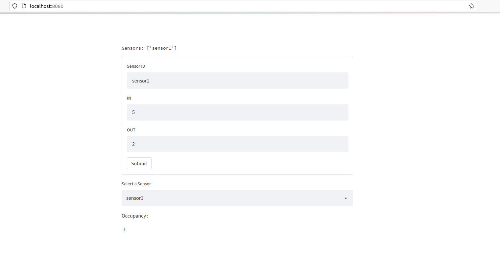

# Meeting Room Occupancy
Version : V3

### Task Goal :

The main goal of this task, is to implement an API to calculate meeting rooms occupancy.

### Specification
The API must include 3 routes :

1. **Webhook**

Allows sensors to publish data about IN/OUT count of persons.

Endpoint :
```
http://hostname/api/webhook
```

Request Example :

```
curl --header "Content-Type: application/json" \
        --request POST --data \
        '{"sensor":"abc","ts":"2018-11-14T13:34:49Z","in_count":3,"out":2}' \
        http://hostname/api/webhook
```

2. **Users**

Allows third party applications, through a GET request to get sensors list.

Endpoint :
```
http://hostname/api/sensors
```

Request Example :

```
curl --request GET http://hostname/api/sensors
```

Response Example :

```
{
    "sensors": [
        "abcd"
    ]
}
```

3. **Occupancy**

Allows third party applications, through a GET request to get occupancy on a specific room.

Endpoint :
```
http://hostname/api/sensors/<sensor>/occupancy
```

Request Example :

```
curl --request GET http://hostname/api/sensors/abc/occupancy
```

Response Example :

```
{
    "inside": 3,
    "sensor": "abcd"
}
```

**_Optionnaly:_** 

4. **Occupancy at a given instant**

Allows third party applications, through a GET request to get occupancy on a specific room at a specific instant.

Endpoint :
```
http://hostname/sensors/<sensor>/occupancy?atInstant=<instant>
```

Request Example :

```
curl --request GET
http://hostname/sensors/abc/occupancy?atInstant=2018-11-14T14:00:00Z
```

Response Example :

```
{
    "inside": 3
}
```

### Implementation

At this version of implementation, the solution is an all-in-one standalone app, that handles all the api specs through different routes.

**Technical stack**

The Stack mainly is Python with  version :
```
Python 3.8.10

```

This implementation uses Flask framework 
```
Name: Flask
Version: 2.0.3
```

**Main app tree**

The main.py contains all the routes implementation and DATA management
```
.
├── app
│   ├── data_manager.py
│   ├── __init__.py
│   ├── main.py
│   ├── mro_data_manager.py

```

**Tests tree**

Implemented tests covers unit, functional tests and __Postman__ collection used to test the API.
```
tests
├── conftest.py
├── functional
│   ├── functional_scenario_test.py
│   └── __init__.py
├── __init__.py
├── postman
│   ├── __init__.py
│   └── mro_api_test.postman_collection.json
└── unit
    ├── api_is_up_test.py
    ├── get_sensors_list_test.py
    ├── __init__.py
    ├── occupancy_at_instant_nok_test.py
    ├── occupancy_at_instant_ok_test.py
    ├── occupancy_nok_test.py
    ├── occupancy_ok_test.py
    ├── webhook_query_nok_test.py
    └── webhook_query_ok_test.py
```

### Usage
**Running the API**

Create a __virtual env__ using :
```shell
python -m venv venv
```
Activate the virtual environment
```shell
source venv/bin/activate
```


Install required packages :
```shell
pip install requirement.txt
```

By default, the app will run on :
>localhost:8088


```shell
$ python app/main.py 
[15:07:36] {app/main.py:13} DEBUG - *****        APP BOOTUP  ****
 * Serving Flask app 'main' (lazy loading)
 * Environment: production
   WARNING: This is a development server. Do not use it in a production deployment.
   Use a production WSGI server instead.
 * Debug mode: on
[15:07:36] {/home/helmi/PycharmProjects/meeting_room_occupancy/venv/lib/python3.8/site-packages/werkzeug/_internal.py:225} INFO -  * Running on http://localhost:8088/ (Press CTRL+C to quit)
[15:07:36] {/home/helmi/PycharmProjects/meeting_room_occupancy/venv/lib/python3.8/site-packages/werkzeug/_internal.py:225} INFO -  * Restarting with stat
[15:07:36] {/home/helmi/PycharmProjects/meeting_room_occupancy/app/main.py:13} DEBUG - *****     APP BOOTUP  ****
[15:07:36] {/home/helmi/PycharmProjects/meeting_room_occupancy/venv/lib/python3.8/site-packages/werkzeug/_internal.py:225} WARNING -  * Debugger is active!
[15:07:36] {/home/helmi/PycharmProjects/meeting_room_occupancy/venv/lib/python3.8/site-packages/werkzeug/_internal.py:225} INFO -  * Debugger PIN: 504-944-124

```

**Running tests**


```shell
$ pytest --cov="."
====================================================================================================== test session starts =======================================================================================================
platform linux -- Python 3.8.10, pytest-7.1.1, pluggy-1.0.0
rootdir: /home/helmi/PycharmProjects/meeting_room_occupancy, configfile: pytest.ini
plugins: cov-3.0.0
collected 9 items                                                                                                                                                                                                                

tests/functional/functional_scenario_test.py::test_scenario PASSED                                                                                                                                                         [ 11%]
tests/unit/api_is_up_test.py::test_home_page PASSED                                                                                                                                                                        [ 22%]
tests/unit/get_sensors_list_test.py::test_get_sensor_list PASSED                                                                                                                                                           [ 33%]
tests/unit/occupancy_at_instant_nok_test.py::test_occupancy_at_instant_sensors_empty 
--------------------------------------------------------------------------------------------------------- live log call ----------------------------------------------------------------------------------------------------------
2022-03-28 12:45:09 [    INFO] meeting room rooftop not found. Exception list index out of range (main.py:101)
PASSED                                                                                                                                                                                                                     [ 44%]
tests/unit/occupancy_at_instant_ok_test.py::test_occupancy_at_instant PASSED                                                                                                                                               [ 55%]
tests/unit/occupancy_nok_test.py::test_occupancy_nok 
--------------------------------------------------------------------------------------------------------- live log call ----------------------------------------------------------------------------------------------------------
2022-03-28 12:45:09 [    INFO] meeting room RDC not found. Exception list index out of range (main.py:80)
PASSED                                                                                                                                                                                                                     [ 66%]
tests/unit/occupancy_ok_test.py::test_occupancy PASSED                                                                                                                                                                     [ 77%]
tests/unit/webhook_query_nok_test.py::test_webhook_query_nok PASSED                                                                                                                                                        [ 88%]
tests/unit/webhook_query_ok_test.py::test_webhook_query_ok PASSED                                                                                                                                                          [100%]

---------- coverage: platform linux, python 3.8.10-final-0 -----------
Name                      Stmts   Miss Branch BrPart  Cover
-----------------------------------------------------------
app/__init__.py               0      0      0      0   100%
app/data_manager.py          26      9     14      3    60%
app/main.py                  60      9      6      3    82%
app/mro_data_manager.py      29      0     18      0   100%
-----------------------------------------------------------
TOTAL                       115     18     38      6    82%


======================================================================================================= 9 passed in 0.22s ========================================================================================================
```

# Bonus Section

### __Add Simple frontend as client__

To simulate a client for the API, a frontend is added to the project. The web page is developed using __streamlit__, which is a framework used mainly for designing awesome graphs mainly for data representation.

__Implementation__

Streamlit run as single file. it is located on the project under the frontend directory.
```shell
frontend/
├── Dockerfile
├── frontend.py
└── requirements.txt
```

__Frontend Welcome page__



### __Dockerize ALL__

The project contains also docker stuff to run the backend and the frontend apps.

__Running using Docker__

It is highly preferable to __run the app through docker__. This resolve the permissions denied issue when running on port 80, without using root.

To run the app : 
```shell
docker-compose up -d --build
```

APP BOOT : 
```shell
mro_api_1  | [2022-03-27 13:49:58 +0000] [1] [INFO] Starting gunicorn 20.1.0
mro_api_1  | [2022-03-27 13:49:58 +0000] [1] [INFO] Listening at: http://0.0.0.0:80 (1)
mro_api_1  | [2022-03-27 13:49:58 +0000] [1] [INFO] Using worker: sync
mro_api_1  | [2022-03-27 13:49:58 +0000] [8] [INFO] Booting worker with pid: 8
mro_api_1  | [13:49:58] {/usr/src/mro_api/app/main.py:13} DEBUG - *****          APP BOOTUP  ****
web_1      | 
web_1      |   You can now view your Streamlit app in your browser.
web_1      | 
web_1      |   Network URL: http://172.21.0.3:8080
web_1      |   External URL: http://176.160.198.33:8080
web_1      | 

```

The API runs on :
> http://localhost:80

The Frontend runs on :
> http://localhost:8080


## Code Quality Indicators
To enhance readability and clearness of the code, the below tools are used :
1. Flake8 

To run flake8, in the project dir:
>$ flake8

flake8 config file is located under *.flake8*  :

2. black : search for PEP compliance errors.

To run black, in the project dir:
>$ black . --check
>$ black . --diff
>$ black .

Black output, after format :
```shell
$ black .
All done! ✨ 🍰 ✨
17 files left unchanged.
```

2. black : search for PEP compliance errors.

To run black, in the project dir:
>$ black . --check
>$ black . --diff
>$ black .

Black output, after format :
```shell
$ black .
All done! ✨ 🍰 ✨
17 files left unchanged.
```

3. Isort : to sort all import on project files

Running isort:
```shell
$ isort . --check-only
$ isort 
```

4. Pytest Code-coverage 
```shell
$ pytest --cov="."

---------- coverage: platform linux, python 3.8.10-final-0 -----------
Name                      Stmts   Miss Branch BrPart  Cover
-----------------------------------------------------------
app/__init__.py               0      0      0      0   100%
app/data_manager.py          26      9     14      3    60%
app/main.py                  60      9      6      3    82%
app/mro_data_manager.py      29      0     18      0   100%
-----------------------------------------------------------
TOTAL                       115     18     38      6    82%


======================================================================================================= 9 passed in 0.22s ========================================================================================================

```

__HTML__ reports for coverage are also available under :
```shell
$ tree tests/coverage/
tests/coverage/
├── coverage_html.js
├── d_5f5a17c013354698_data_manager_py.html
├── d_5f5a17c013354698___init___py.html
├── d_5f5a17c013354698_main_py.html
├── d_5f5a17c013354698_mro_data_manager_py.html
├── favicon_32.png
├── index.html
├── keybd_closed.png
├── keybd_open.png
├── status.json
└── style.css

```